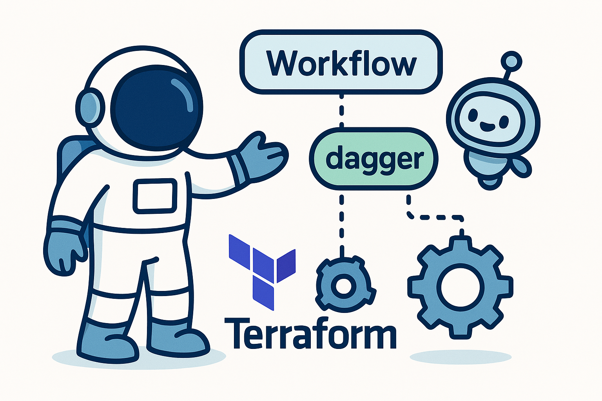

# 🚀 Dagger Module Demo

A demonstration of Dagger CI/CD pipeline orchestration with modular components for common Terraform workflows.



### Requirements

- dagger-cli
- dagger-cloud (optional)
- golang (optional)
- terraform (optional)

## ⚙️ Quick Start

```
# Installs dagger-cli and other dependencies
devbox shell  

# Run lint on your Terraform code
dagger -m .dagger call lint --directory .

# Run tests
dagger -m .dagger call test --directory ./terraform
```

## 📚 Architecture

- `.dagger`: Core orchestrator module that composes pipeline jobs
- Submodules: Specialized functionality (pre-commit, commitlint, localstack)
- External modules: Additional tools from [daggerverse](https://daggerverse.dev)

## 💻 Development

You will need go >= v1.24 if want mess around with the dagger code.

```
# Generate module code (run from module directory)
cd .dagger  # or submodule directory
dagger develop

# List available functions
dagger functions

# Get help for specific function
dagger call test --help

# Install external module
dagger install github.com/fcanovai/daggerverse/commitlint@ecd31bc86ff0d416f2cecd2c7c5dad5770941cd8
```

> [!NOTE]
> Run functions from your project root with -m .dagger flag or from within module directories directly.
> dagger -m .dagger call test --help

---

## References

- [Dagger Documentation](https://docs.dagger.io)
- [Dagger Cloud](https://docs.dagger.io/configuration/cloud/#step-2-connect-to-dagger-cloud)
- [Modules](https://docs.dagger.io/configuration/modules/)
- [Dagger Github Organization](https://github.com/dagger)
